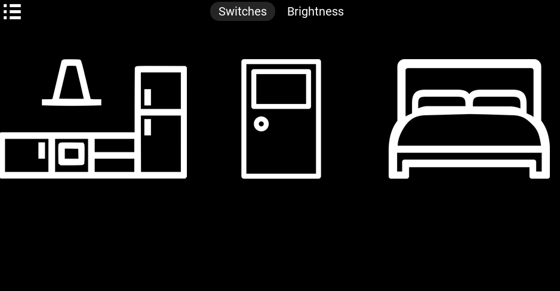
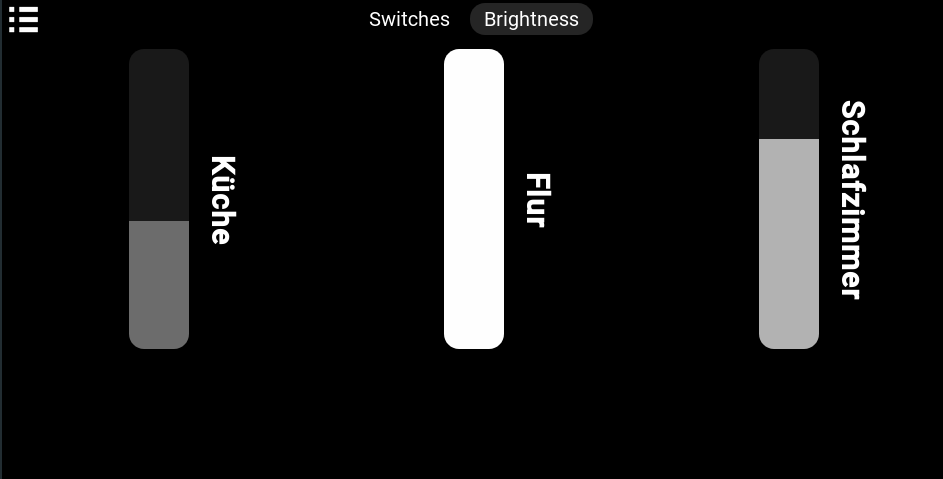
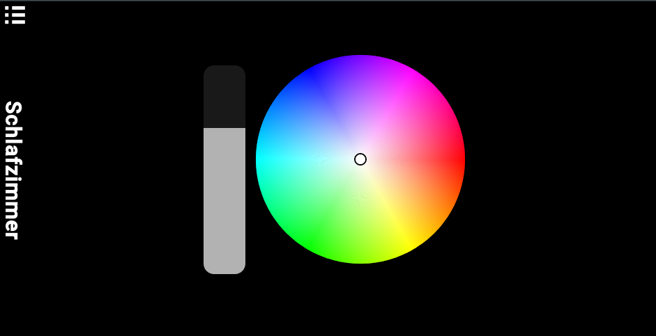

# HomePanel

## Light ControlPanel

### Usage

#### Dashboard

The dasboard serves as the main entry point to the light panel and shows a selection of lights/groups
It can be reached via '/lights' or '/lights/dashboard'.

Two core functions are the display of the lights as "switches" and as "dimmers".

#### Settings

The settings for each light are displayed on this page.
It can be reaced via 'light/sources/:id/conf''

The two core funtions of this page are to display the "dimmer" and the "color picker"

#### Settings

### Development Information

#### Entities

The main entities of the light controlpanel are the "panel lightsource" and the "hue lightsource".

Why seperate entities?
The lightsources are split, because the "panel lightsource" serves to represent the entity in context of the panel structure. It keeps the icons, position, name, etc.

The functionality of Hue is split out to a different entity. This tries to allow future use of different vendor protocolls. The Hue entity is only focused on handeling interactions with the hue components.

Why "lightsource"?
The term is abstracted because there are several types of concepts, like "lights", "groups", "scenes", ...
The design thought tries to bundle the behaviour when ever it is posible
Currently only the type "group" is implemented.

#### Hue

All Hue related code can be found in the shared/hue folder.
The three mayor classes are

* Hue Model (lightsource)
* Hue Async Controler
* Hue IO

##### Hue Model

As described, the Hue Model tries to generate the interface for a element (light, group, etc).
It interacts with the Hue Async Controler.

##### Hue Async Controler

The Hue Async Controler tries to build a seperator between the physical hue bridge and the app.
Goal is to minimize the calls done to the hue bridge, even if the app is scaling.

It uses a seperate "states" property and a "changes" property.
There are two async jobs for fetching the states of the bridge and sending the changes to it.

##### Hue IO

The Hue IO class builds the interface to the bridge. It abstracts the http calls into simple methods.